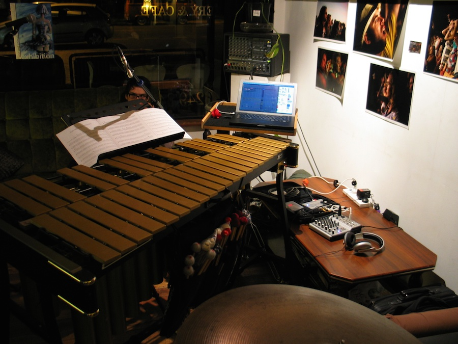
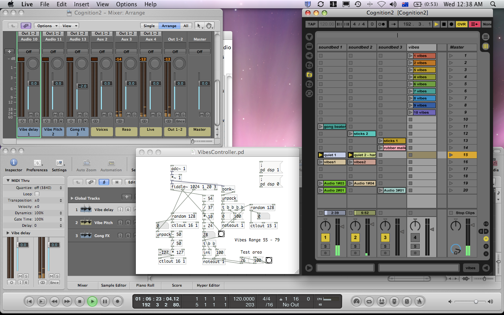
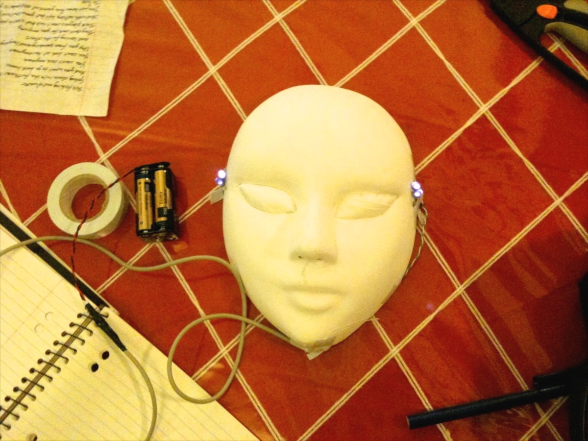
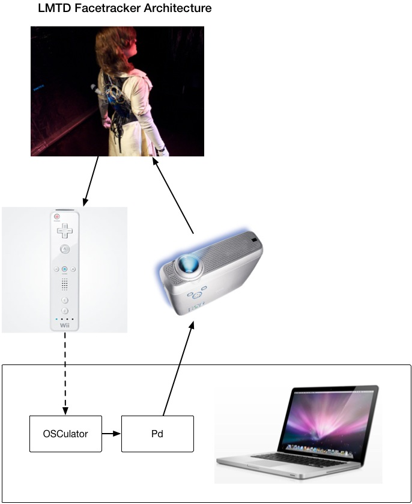
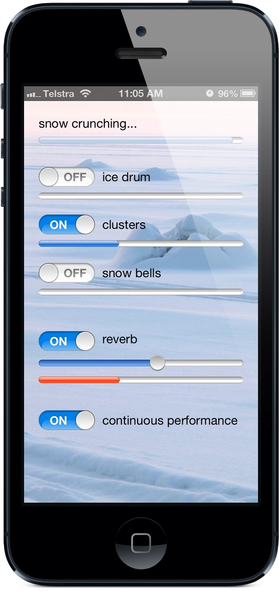
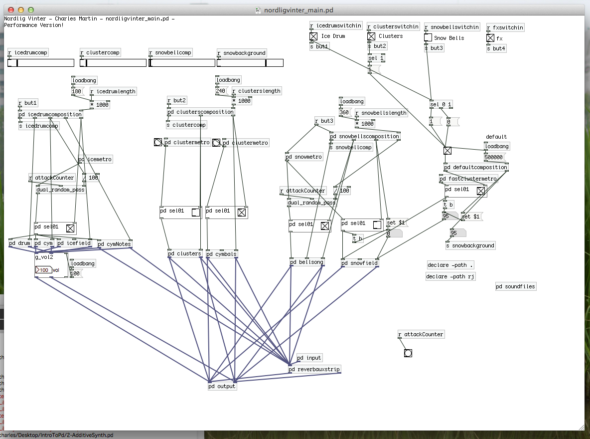
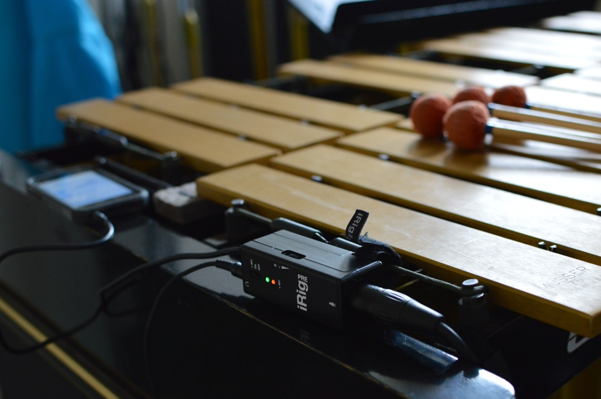

# intro to computer music with Pd

- Charles Martin
- 2014-2022

## why computer music?

- timbre
  - synthesis
  - recordings
- control
  - automation
  - no humans
- not-control
  - randomness
- interaction
  - connect to:
    - visuals
    - lights
    - sensors
    - audience
    - instruments
    - robots
    - internet
    - data
    - automation

## why Pure Data (Pd)?

- free
- visual
- old
- works on (almost) everything (mac, windows, linux, smartphones, raspberry pis)

## reality: more than one tool

- lots of computer musicians use a mix of tools
    - Ableton - for messing with sound files and loops
    - Logic/Mainstage or other for synths
    - Pd for gluing things together
- communication through OSC or MIDI

Here's some examples of works I've created using Pd and other hardware and
software to make music.

### music for vibraphone and computer

_music for vibraphone and computer_ was an improvised work I created so that I
could play vibes and ableton at the same time. I had a whole bunch of
percussion recordings and samples prepared in ableton and I found that with a
Pd patch tracking pitch of the vibes through a microphone, I could use Pd to
control ableton and layer up what I was playing on the acoustic instrument with
the samples. With the addition of a lot of new (to me) audio effects in ableton
and logic, I had enough material for a 10- to 15- minute piece.

I wrote up some of this as [part of my coursework at ANU](https://doi.org/10.25911/5d70f15d14cc2).





### Facetracker

Facetracker was a fairly wild idea to use Pd to control projection mapping in a
live environment. I was working with an actor, [Hanna
Cormick](https://www.hannacormick.com), who was deep into mask work and we had
the idea of trying to project on to a blank white mask. We shot some video of
Hanna performing a monologue and edited out just the face. For tracking, we
attached IR LEDs to the mask and used a Nintendo Wii controller (yes, really)
which could track IR lights and output a signal over bluetooth to the computer.
The Wii controller connected to Osculator on the computer, which sent OSC to
Pd, which translated the video file using Gem.

A video of the work is still [here on vimeo](https://vimeo.com/8325409)





Well, the whole thing was a rather silly idea. Getting the Wii controller and projector lined up was tough and it wasn't quite clear why we were projecting Hanna's face back on to Hanna wearing a mask. This one didn't go any further, but a cool example.

### Nordlig Vinter

So Nordlig Vinter was [an album](https://charlesmartin.au/nordlig-vinter/) that
I created while studying in Piteå, Sweden. It's mostly percussion ensemble
works with some computer soundtracks created in Pd.

Part of the inspiration for this album was the idea of getting the Pd
soundtracks onto an iPhone or an iPad to perform _without_ a laptop on stage.
In fact, this was what my master thesis was [all
about](https://hdl.handle.net/2027/spo.bbp2372.2013.073). The Pd patches
started out in an app called RjDJ that could play back specially packaged up Pd
files, but I later created my own app just for doing these performances.







In the Nordlig Vinter app (and all my subsequent iOS work), I used the `libpd`
distribution of _just_ the sound engine from Pd which can be connected in with
Core Audio. The app itself isn't very interesting as it's just for playing back
different sound environments and applying effects to the sound over the
microphone. I used to play some works from the album solo with my phone just
balanced on the edge of the vibes and a mic underneath the instrument to pick
up some sound for the effects.

## Examples: Live Patching

- Synthesis:
+ “hello world” sine tone
+ Basic Additive sine Tones
+ FM Synthesis
- Recordings:
+ Playing back a sound file
+ messing with a sound file
- Control
+ ADSR Envelope Generator
+ Controlling multiple instruments
- Not-Control
+ Random Values
+ Markov Chains
- Interaction
+ Fiddle and Bonk
+ Sensors
+ New Interface
+ MIDI / OSC


## why not Pd?

- visual programming sucks (write once, read never)
    - where does the program start? hard to tell.
    - make 10 synths? Sure - copy and paste.
    - make 100 synths? Uh....
- can do in SuperCollider for example:

```
100 .do({{SinOsc.ar(Rand.new(35.0,2000.0), 0 ,[0.1,0.1], 0 )}.play;})
```

- doesn't work on the web

## links:

- getting started with percussion and computer music (2011): <http://charlesmartin.au/blog/2011/3/27/getting-started-in-computer-music-and-percussion.html>
- how to learn Pd (2014): <http://charlesmartin.au/blog/2014/3/11/how-to-learn-pd>
- computer music intro repository: <https://github.com/cpmpercussion/>

